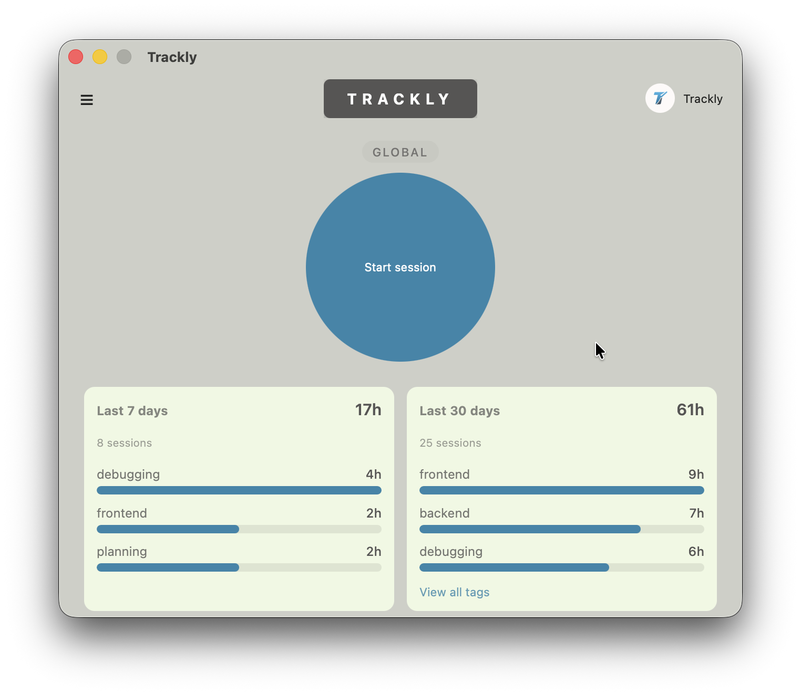
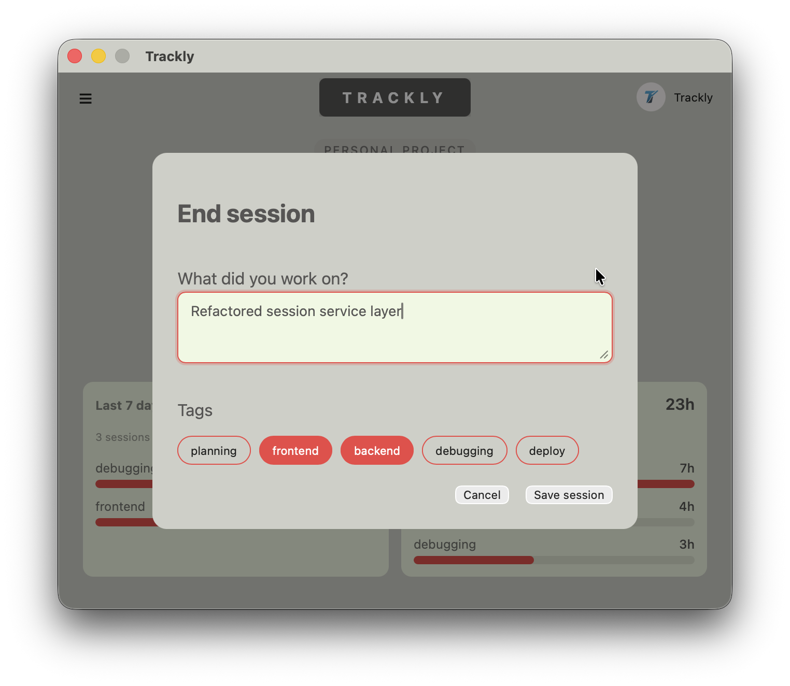
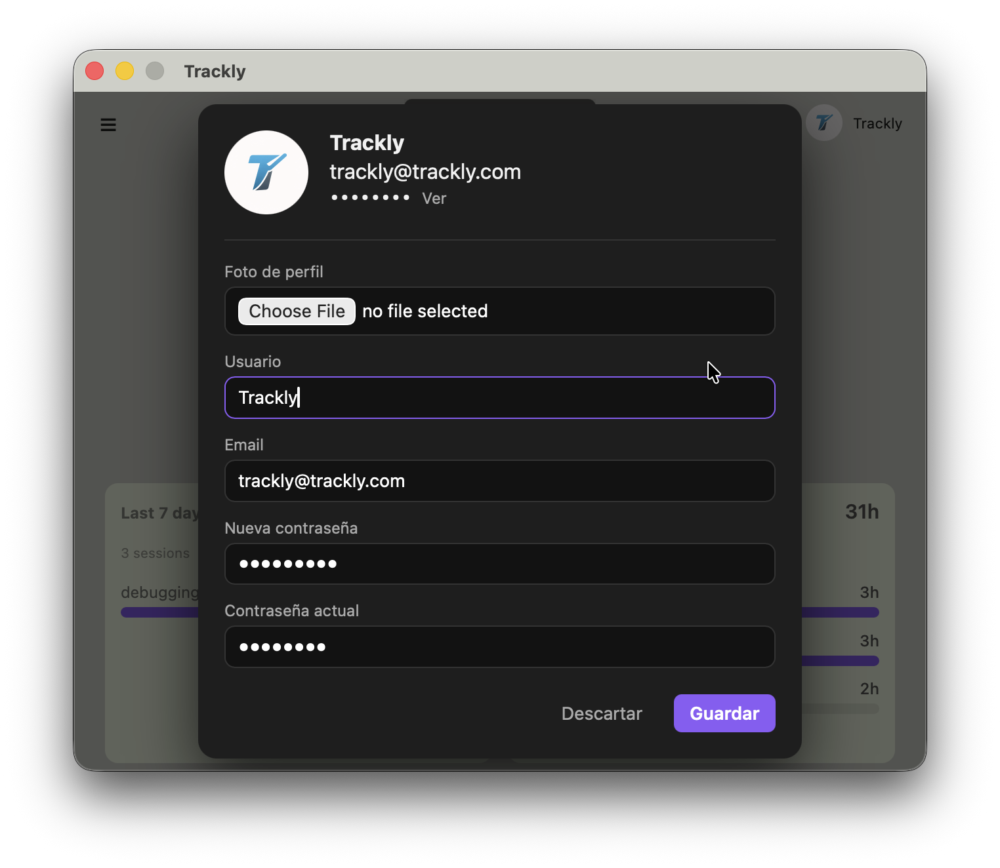

# Trackly

Trackly is a minimal, native cross-platform desktop time-tracking application built with Tauri v2, Rust, Astro, and React.

It is a local-first productivity tool focused on performance, simplicity, and privacy.

Unlike most time trackers, Trackly does not rely on cloud services. Everything runs locally on your machine.

---

## 🖥️ Platforms

Trackly is available for:

- macOS (.dmg)
- Windows (.msi)
- Linux (.AppImage)

All builds are automatically generated via GitHub Actions.

---

## ✨ Features

- Project-based time tracking  
- Start / Stop sessions  
- Cancel sessions  
- Session descriptions and tagging  
- 7-day and 30-day statistics  
- Tag-based activity breakdown  
- Avatar upload (image resizing & WebP compression)  
- Persistent login session  
- Local SQLite storage (no cloud, no telemetry)  
- Native desktop performance (via Tauri)  

---

## 🧠 Philosophy

Trackly is:

- Local-first — your data stays on your machine  
- Fast — powered by Rust and SQLite  
- Minimal — focused on clarity and usability  
- Open source — fully inspectable and modifiable  

No backend servers.  
No analytics.  
No telemetry.  

---

## 🏗 Tech Stack

### Frontend
- Astro  
- React  
- TypeScript  
- CSS  

### Backend
- Rust  
- Tauri v2  
- SQLite (rusqlite)  
- Argon2 (password hashing)  
- Image processing (avatar resizing)  
- UUID  

---

## ⚡ Why Tauri?

Trackly leverages Tauri to provide:

- Native performance  
- Small bundle size  
- Secure Rust backend  
- Modern web frontend  
- Cross-platform builds  
- Strong separation between UI and system layer  

This allows the application to remain lightweight while maintaining a robust architecture.

---

## 📸 Screenshots

### Dashboard

### Session Modal

### Profile View

---

## 💾 Data Storage

Trackly stores all data locally using SQLite.

### Database locations

**macOS**

    ~/Library/Application Support/com.marcos.trackly/trackly.db

**Windows**

    C:\Users\USERNAME\AppData\Roaming\com.marcos.trackly\trackly.db

**Linux**

    ~/.local/share/com.marcos.trackly/trackly.db

The schema includes:

- users  
- projects  
- sessions  
- session_tags  
- app_session  

Passwords are securely hashed using Argon2.

---

## 🚀 Installation

Download the latest release from the Releases section.

### macOS

1. Download the .dmg  
2. Move Trackly.app to Applications  
3. If macOS blocks it:
   - Right click → Open  
   - Confirm  

### Windows

1. Download the .msi  
2. Run installer  
3. If SmartScreen appears:
   - Click “More info”  
   - Click “Run anyway”  

### Linux

1. Download the .AppImage  
2. Make it executable:

    chmod +x Trackly-x.x.x.AppImage

3. Run it:

    ./Trackly-x.x.x.AppImage

Note: The app is not currently code-signed. Your system may show security warnings.

---

## 🛠 Development

### Requirements

- Node.js  
- Rust  
- Tauri CLI  

### Run in development mode

    npm install
    npx tauri dev

### Build production bundle

    npx tauri build

---

## 📌 Current Status

This is the initial public release (v0.1.0).

The core features are stable and production-ready, but the project is actively evolving.

---

## 📦 Project Structure

    trackly/       → Astro + React frontend  
    src-tauri/     → Rust backend  

Architecture layers:

- Commands (Tauri interface)  
- Services (business logic)  
- Domain models  
- Infrastructure (SQLite)  

---

## 🔐 Security

- Password hashing via Argon2  
- No plaintext storage  
- No external API calls  
- No telemetry  
- Fully local data ownership  

---

## 🛣 Roadmap

Planned improvements:

- Database migrations system  
- CSV export  
- Auto-updater  
- Dark mode  
- Improved analytics  
- Code signing  
- Installer polish  

---

## 📜 License

This project is licensed under the MIT License.

See the LICENSE file for details.

---

## 🤝 Contributing

Pull requests are welcome.

If you'd like to contribute:

1. Fork the repository  
2. Create a feature branch  
3. Open a PR  

---

## 👤 Author

Built by Marcos Finkielsztajn